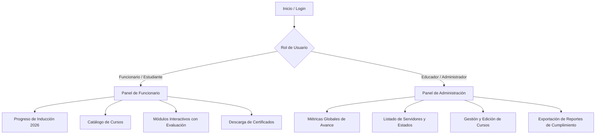

# Documentación Técnica y Funcional: CAMPUS INFIBAGUÉ

Sistema Integrado de Inducción, Reinducción y Capacitación Institucional para Servidores Públicos de **INFIBAGUÉ** (Instituto de Financiamiento, Promoción y Desarrollo de Ibagué).

---

## 📑 Tabla de Contenido
1. [Visión General del Sistema](#1-visión-general-del-sistema)
2. [Stack Tecnológico y Lenguajes por Componente](#2-stack-tecnológico-y-lenguajes-por-componente)
3. [Arquitectura de Roles y Vistas](#3-arquitectura-de-roles-y-vistas)
   - [3.1 Vista del Funcionario (Estudiante)](#31-vista-del-funcionario-estudiante)
   - [3.2 Vista del Educador / Administrador](#32-vista-del-educador--administrador)
4. [Estructura y Construcción de los Cursos](#4-estructura-y-construcción-de-los-cursos)
   - [4.1 Módulo 1: Atención al Ciudadano](#41-módulo-1-atención-al-ciudadano)
   - [4.2 Módulo 2: Gestión Humana](#42-módulo-2-gestión-humana)
   - [4.3 Módulo 3: Gestión Ambiental](#43-módulo-3-gestión-ambiental)
   - [4.4 Módulo 4: Seguridad y Salud en el Trabajo (SST)](#44-módulo-4-seguridad-y-salud-en-el-trabajo-sst)
   - [4.5 Módulo 5: Planeación Estratégica](#45-módulo-5-planeación-estratégica)
5. [Motor de Progreso, Calificación y Almacenamiento](#5-motor-de-progreso-calificación-y-almacenamiento)
6. [Sistema de Certificación Digital (Evidencia ICONTEC)](#6-sistema-de-certificación-digital-evidencia-icontec)
7. [Estructura de Base de Datos y Seguridad (Supabase & RLS)](#7-estructura-de-base-de-datos-y-seguridad-supabase--rls)
8. [Mapa de Archivos del Proyecto](#8-mapa-de-archivos-del-proyecto)

---

## 1. Visión General del Sistema

El **Campus Virtual INFIBAGUÉ** es una plataforma LMS (*Learning Management System*) interactiva, modular y ligera diseñada específicamente para cumplir con los requerimientos de formación de servidores públicos (~200 funcionarios entre personal administrativo y operativo).

### Objetivos Clave:
- **Formación Diferenciada:** Adaptación de contenido y niveles de evaluación según el perfil del usuario (**Administrativo** u **Operativo**).
- **Interactividad y Gamificación:** Inclusión de carruseles interactivos, juegos de asociación, guías animados (*Luminito*) y retroalimentación en tiempo real.
- **Validez y Auditoría:** Emisión de certificados digitales en PDF con código único de verificación para cumplimiento de auditorías de calidad **ICONTEC**.
- **Persistencia Híbrida:** Funcionamiento con base de datos en tiempo real (**Supabase / PostgreSQL**) y mecanismos de respaldo local (**LocalStorage**).

---

## 2. Stack Tecnológico y Lenguajes por Componente

El sistema utiliza una arquitectura web basada en estándares modernos sin dependencias pesadas de compilación en el cliente (*Zero-Build Architecture*):

| Componente / Módulo | Lenguaje / Tecnología | Librerías / Frameworks Clave | Propósito |
| :--- | :--- | :--- | :--- |
| **Frontend Core** | HTML5 Semántico, Vanilla JavaScript (ES6+), CSS3 | Google Fonts (Inter, Poppins, Montserrat), FontAwesome 6 | Estructura, reactividad nativa y maquetación visual |
| **Diseño y Estilos** | CSS Moderno + Tailwind CSS (vía CDN) | Flexbox, CSS Grid, Custom Properties (Variables CSS) | Sistema de diseño responsivo y paleta institucional |
| **Componentes Interactivos (Gestión Humana)** | JavaScript (React 18 + JSX en el navegador) | `react.production.min.js`, `react-dom.production.min.js`, Babel Standalone | Interfaces declarativas por componentes para dinámicas de aprendizaje |
| **Backend & Base de Datos** | PostgreSQL (Relacional) en Supabase | Supabase JS Client v2, SQL DDL/DML, Row Level Security (RLS) | Autenticación, persistencia de progreso, tablas de cursos e inscripciones |
| **Certificación Digital** | JavaScript en Cliente | **jsPDF** v2.5.1 + Canvas API | Renderizado y descarga de diplomas oficiales en PDF de alta resolución |
| **Despliegue e Infraestructura** | Servidor Web Estático | Vercel (`vercel.json`), Netlify o Nginx/Apache | Distribución estática de alto rendimiento y bajo consumo |

---

## 3. Arquitectura de Roles y Vistas

El sistema maneja control de acceso basado en roles (**RBAC**):



---

### 3.1 Vista del Funcionario (Estudiante)
**Rutas principales:** `funcionario/dashboard.html`, `funcionario/certificados.html`, `cursos/index.html`

- **Dashboard Principal:**
  - Banner de bienvenida personalizado con nombre y cédula.
  - Barra general de progreso del programa de **Inducción y Reinducción 2026** (calculada dinámicamente con los 5 módulos institucionales).
  - Tarjetas interactivas de cada módulo temático con estado (No iniciado, En progreso, Completado) y botón directo de acceso.
  - Historial de calificaciones obtenidas y horas acumuladas de formación.
- **Visualizador de Cursos:**
  - Experiencia inmersiva en pantalla completa con navegación por pasos o carrusel.
  - Selección de perfil laboral (**Administrativo** u **Operativo**) antes de iniciar el curso.
  - Evaluaciones bloqueadas hasta completar la lectura del material.
- **Sección de Certificados:**
  - Galería de certificaciones obtenidas con botón de descarga inmediata en PDF.

---

### 3.2 Vista del Educador / Administrador
**Rutas principales:** `educador/dashboard.html`, `educador/crear-curso.html`, `educador/editar-curso.html`, `educador/seguimiento.html`

- **Dashboard de Control y Analítica:**
  - Tarjetas de estadísticas en tiempo real: Total de funcionarios registrados, porcentaje global de avance institucional, funcionarios certificados y cursos activos.
  - Monitoreo de períodos de inducción activos (ej. *Inducción y Reinducción 2026*).
- **Seguimiento Individual y Grupal:**
  - Tabla de funcionarios con búsqueda por nombre o cédula, filtro por dependencia y estado de aprobación.
  - Vista del avance módulo por módulo de cada funcionario.
- **Gestión Curricular:**
  - Creación y edición de cursos, módulos, lecciones, enlaces de video, material complementario y cuestionarios.

---

## 4. Estructura y Construcción de los Cursos

El programa de Inducción y Reinducción de INFIBAGUÉ está compuesto por **5 módulos fundamentales**:

```
cursos/
├── induccion-atencion-ciudadano.html   # Módulo 1: Atención al Ciudadano
├── induccion-gestion-humana.html        # Módulo 2: Gestión Humana
├── induccion-gestion-ambiental.html     # Módulo 3: Gestión Ambiental
├── induccion-sst.html                   # Módulo 4: Seguridad y Salud en el Trabajo
└── induccion-planeacion.html            # Módulo 5: Planeación Estratégica
```

---

### 4.1 Módulo 1: Atención al Ciudadano
- **Archivo:** [`cursos/induccion-atencion-ciudadano.html`](file:///c:/Workspace/Projects/CAMPUS-INFIBAGUE/cursos/induccion-atencion-ciudadano.html)
- **Tecnología:** HTML5, CSS Glassmorphism nativo, Vanilla JavaScript (`atencion-ciudadano-carousel.js` / `induccion.js`).
- **Contenido y Temáticas:**
  - Atributos del buen servicio público y ética en la atención.
  - Trámite y tiempos de respuesta de **PQRSD** (Ley 1755 de 2015).
  - Canales de atención presenciales, virtuales y telefónicos de INFIBAGUÉ.
  - Protocolos de comunicación oficial escrita y verbal.
- **Dinámica:**
  - Personaje guía institucional (*Luminito*).
  - Navegación por tarjetas expandibles y carrusel de diapositivas interactivas.
  - Evaluación diferenciada (5 preguntas para Administrativos / 3 para Operativos).

---

### 4.2 Módulo 2: Gestión Humana
- **Archivo:** [`cursos/induccion-gestion-humana.html`](file:///c:/Workspace/Projects/CAMPUS-INFIBAGUE/cursos/induccion-gestion-humana.html)
- **Tecnología:** **React 18** (en el cliente vía CDN y Babel standalone), Tailwind CSS, Vanilla JS.
- **Contenido y Temáticas:**
  - Estructura organizacional y cultura corporativa de INFIBAGUÉ.
  - Derechos, deberes y prohibiciones del servidor público.
  - Evaluación del desempeño laboral y acuerdos de gestión.
  - Plan de bienestar, estímulos, capacitación y vacaciones.
- **Dinámica:**
  - Componentes React modulares con estado reactivo (`useState`, `useEffect`).
  - Dinámica interactiva de juego/asociación conceptual sobre normativas de talento humano.

---

### 4.3 Módulo 3: Gestión Ambiental
- **Archivo:** [`cursos/induccion-gestion-ambiental.html`](file:///c:/Workspace/Projects/CAMPUS-INFIBAGUE/cursos/induccion-gestion-ambiental.html)
- **Tecnología:** HTML5, CSS nativo optimizado con variables CSS, JavaScript ES6+, Supabase SDK.
- **Contenido y Temáticas:**
  - Política ambiental institucional y Sistema de Gestión Ambiental (SGA - ISO 14001).
  - Código de colores para la separación en la fuente (Resolución 2184/2019).
  - Programas de ahorro y uso eficiente de agua y energía eléctrica.
  - Manejo integral de residuos peligrosos (RESPEL) y ordinarios.
- **Dinámica:**
  - Carrusel inmersivo (*Full-viewport Slide Engine*) con controles táctiles y de teclado.
  - Quices interactivos con retroalimentación visual inmediata.

---

### 4.4 Módulo 4: Seguridad y Salud en el Trabajo (SST)
- **Archivo:** [`cursos/induccion-sst.html`](file:///c:/Workspace/Projects/CAMPUS-INFIBAGUE/cursos/induccion-sst.html)
- **Tecnología:** Tailwind CSS, FontAwesome 6, Vanilla JavaScript, Sistema de Gamificación.
- **Contenido y Temáticas:**
  - Sistema de Gestión de Seguridad y Salud en el Trabajo (SG-SST / Decreto 1072 de 2015).
  - Identificación de peligros, evaluación y valoración de riesgos laborales.
  - Uso correcto de Elementos de Protección Personal (EPP).
  - Reporte e investigación de incidentes y Accidentes de Trabajo (ATEL).
  - Conformación del COPASST, Comité de Convivencia y Brigada de Emergencias.
- **Dinámica:**
  - Formato tipo juego interactivo (*Interactive Game Training*) con botones de pista (*hints*), selección de respuestas y barra de progreso animada.

---

### 4.5 Módulo 5: Planeación Estratégica
- **Archivo:** [`cursos/induccion-planeacion.html`](file:///c:/Workspace/Projects/CAMPUS-INFIBAGUE/cursos/induccion-planeacion.html)
- **Tecnología:** HTML5 semántico, CSS3 avanzado, Supabase Client.
- **Contenido y Temáticas:**
  - Misión, Visión y Valores Institucionales de INFIBAGUÉ.
  - Modelo Integrado de Planeación y Gestión (**MIPG**).
  - Mapa de procesos, caracterizaciones y gestión por procesos.
  - Plan de Acción Institucional, metas, indicadores de gestión y mapa de riesgos.
- **Dinámica:**
  - Líneas de tiempo y esquemas gráficos secuenciales de planificación.
  - Cuestionario evaluativo final para habilitar la certificación.

---

## 5. Motor de Progreso, Calificación y Almacenamiento

El seguimiento del aprendizaje opera mediante un flujo sincrónico con Supabase y respaldo de contingencia:

```
[Usuario responde evaluación]
              │
              ▼
   [js/progress.js: calcularCalificacion()]
              │
     ┌────────┴────────┐
     │ Aprobado ≥ 75%  │
     └────────┬────────┘
              │
  ┌───────────┴───────────┐
  ▼                       ▼
[Supabase: progreso_modulos]   [LocalStorage Fallback]
• user_id, course_id, modulo   • progress_{userId}_induccion_2026
• completado: true             • Array de módulos completados
• calificacion, updated_at
              │
              ▼
 [Actualización de Dashboard y Desbloqueo de Certificado]
```

### Reglas de Negocio:
1. **Porcentaje Mínimo de Aprobación:** **75%** (configurable en `js/config.js`).
2. **Desbloqueo de Certificado:** Se requiere completar y aprobar el 100% de los 5 módulos de inducción.
3. **Manejo Offline / Contingencia:** Si la conexión a la base de datos se interrumpe, el sistema persiste el progreso localmente y lo sincroniza al restablecer conexión.

---

## 6. Sistema de Certificación Digital (Evidencia ICONTEC)

Implementado en [`js/certificates.js`](file:///c:/Workspace/Projects/CAMPUS-INFIBAGUE/js/certificates.js) utilizando la biblioteca **jsPDF**:

- **Elementos del Certificado:**
  - Encabezado oficial y membrete de **INFIBAGUÉ**.
  - Nombre completo y número de cédula del funcionario.
  - Nombre del programa completado y horas académicas acreditadas.
  - Fecha exacta de culminación.
  - **Código único de verificación (Hash / UUID)** para trazabilidad ante auditores.
  - Espacio para firma de la Dirección General / Talento Humano.
- **Compatibilidad:** Generación en el lado del cliente (sin requerir consumo de CPU en el servidor), compatible con dispositivos de escritorio y móviles.

---

## 7. Estructura de Base de Datos y Seguridad (Supabase & RLS)

### Tablas Principales:
1. `usuarios`: Perfil del servidor (id, cedula, nombre_completo, email, rol, cargo, dependencia).
2. `cursos`: Catálogo de cursos (id, titulo, descripcion, duracion_horas, activo, obligatorio).
3. `modulos`: Contenidos temáticos ordenados secuencialmente.
4. `actividades` y `preguntas`: Cuestionarios evaluativos y opciones de respuesta.
5. `inscripciones`: Relación usuario-curso con fecha de inicio y porcentaje de avance.
6. `progreso_modulos` / `progreso_detallado`: Registro pormenorizado de cada módulo aprobado.
7. `certificados`: Historial de diplomas generados con código de verificación.

### Seguridad y RLS (Row Level Security):
- Los funcionarios solo pueden consultar y actualizar su propio progreso (`auth.uid() = user_id`).
- Los educadores y administradores cuentan con políticas de lectura global para reportes de auditoría.

---

## 8. Mapa de Archivos del Proyecto

```
CAMPUS-INFIBAGUE/
├── index.html                           # Landing page institucional del Campus
├── login.html                           # Acceso al sistema
├── registro.html                        # Registro de nuevos servidores públicos
├── catalogo.html                        # Catálogo general de capacitaciones
├── curso-detalle.html                   # Ficha y temario de un curso
│
├── cursos/                              # Módulos de Inducción Institucional
│   ├── index.html                       # Índice interactivo de módulos
│   ├── induccion-atencion-ciudadano.html# Módulo 1: Atención al Ciudadano
│   ├── induccion-gestion-humana.html    # Módulo 2: Gestión Humana (React + Tailwind)
│   ├── induccion-gestion-ambiental.html # Módulo 3: Gestión Ambiental
│   ├── induccion-sst.html               # Módulo 4: SST (Gamificado)
│   ├── induccion-planeacion.html        # Módulo 5: Planeación Estratégica
│   └── README.md                        # Guía específica del subdirectorio cursos
│
├── funcionario/                         # Vistas del Servidor Público
│   ├── dashboard.html                   # Panel principal del funcionario
│   └── certificados.html                # Consulta y descarga de certificados
│
├── educador/                            # Vistas del Docente / Administrador
│   ├── dashboard.html                   # Métricas, analítica y seguimiento
│   ├── crear-curso.html                 # Diseñador de nuevos cursos
│   ├── editar-curso.html                # Editor de módulos y actividades
│   └── seguimiento.html                 # Reporte detallado por funcionario
│
├── css/                                 # Hojas de estilo
│   ├── main.css                         # Variables, reset y tipografía global
│   ├── components.css                   # Botones, tarjetas, modales, alertas
│   ├── induccion.css                    # Estilos de los carruseles y guías
│   └── atencion-ciudadano-enhanced.css  # Efectos visuales de atención al ciudadano
│
├── js/                                  # Lógica JavaScript
│   ├── config.js                        # Configuración institucional y Supabase
│   ├── supabaseClient.js                # Inicialización del cliente de BD
│   ├── auth.js                          # Control de sesión y perfiles
│   ├── progress.js                      # Algoritmo de calificación y avance
│   ├── supabase-progress.js             # Sincronización en tiempo real con Supabase
│   ├── certificates.js                  # Motor de generación de certificados jsPDF
│   ├── courses.js                       # CRUD de cursos y catálogo
│   ├── induccion.js                     # Motor interactivo de cursos
│   └── utils.js                         # Helpers de validación y UI
│
├── assets/                              # Recursos gráficos institucionales
└── CAMPUS_INFIBAGUE.md                  # Esta documentación técnica integral
```

---

*Documento técnico generado para el proyecto **Campus Virtual INFIBAGUÉ** — Febrero/Marzo 2026.*
