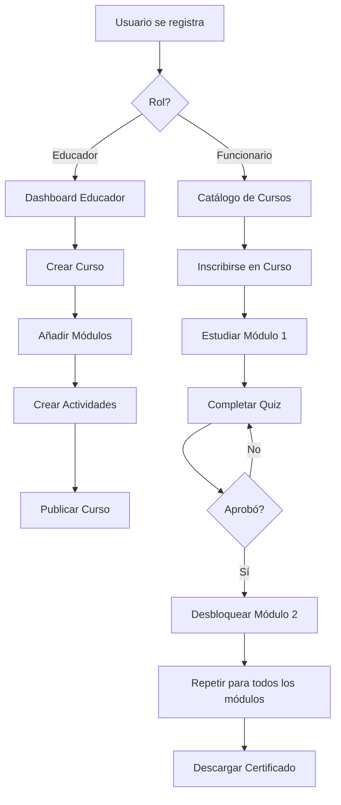

# Campus Virtual - Documentación del Proyecto

## Descripción

Sistema de gestión de aprendizaje (LMS) para entidades públicas con roles diferenciados, gestión de cursos modulares, evaluaciones y certificación automática.

## Características Principales

✅ **Sistema de Autenticación**
- Registro e inicio de sesión con Supabase Auth
- Roles diferenciados: Educador y Funcionario
- Validación de correos institucionales

✅ **Para Educadores**
- Crear y gestionar cursos
- Organizar contenidos en módulos
- Subir materiales (texto, PDFs, videos)
- Crear cuestionarios y actividades
- Seguimiento detallado de funcionarios
- Ver estadísticas de progreso

✅ **Para Funcionarios**
- Explorar catálogo de cursos
- Inscribirse en cursos de interés
- Estudiar módulos secuenciales
- Completar evaluaciones
- Seguimiento de progreso en tiempo real
- Descargar certificados al completar cursos

✅ **Sistema de Progreso**
- Módulos bloqueados hasta completar el anterior
- Calificación automática de quizzes
- Cálculo dinámico de porcentaje de avance
- Validación de criterios de aprobación

✅ **Certificados Digitales**
- Generación automática en PDF
- Diseño institucional profesional
- Registro en base de datos
- Descarga instantánea

## Tecnologías Utilizadas

- **Frontend**: HTML5, CSS3 (Vanilla), JavaScript ES6+
- **Backend**: Supabase (PostgreSQL + Auth + Storage)
- **PDF**: jsPDF
- **Estilos**: Sistema de diseño personalizado con variables CSS
- **Hosting**: Compatible con cualquier servidor web estántico (Vercel, Netlify, etc.)

## Estructura del Proyecto

```
CAMPUS/
├── index.html                 # Página de inicio
├── registro.html              # Registro de usuarios
├── login.html                 # Inicio de sesión
├── catalogo.html              # Catálogo de cursos
├── curso-detalle.html         # Detalle del curso
├── SUPABASE_SETUP.md          # Instrucciones de configuración de BD
├── README.md                  # Este archivo
│
├── css/
│   ├── main.css               # Estilos globales
│   ├── components.css         # Componentes reutilizables
│   └── roles.css              # Estilos por rol (a crear)
│
├── js/
│   ├── config.js              # Configuración de Supabase
│   ├── utils.js               # Funciones utilitarias
│   ├── auth.js                # Autenticación
│   ├── courses.js             # Gestión de cursos
│   ├── progress.js            # Sistema de progreso
│   └── certificates.js        # Generación de certificados
│
├── educador/
│   ├── dashboard.html         # Panel del educador
│   ├── crear-curso.html       # Crear nuevo curso
│   ├── editar-curso.html      # Editar curso y módulos
│   └── seguimiento.html       # Seguimiento de estudiantes
│
├── funcionario/
│   ├── dashboard.html         # Panel del funcionario
│   ├── mis-cursos.html        # Cursos inscritos
│   └── certificados.html      # Certificados obtenidos
│
└── assets/
    └── logo-entidad.png       # Logo institucional
```

## Instalación y Configuración

### Paso 1: Configurar Supabase

1. Crea una cuenta en [Supabase](https://supabase.com)
2. Crea un nuevo proyecto
3. Ejecuta los scripts SQL del archivo `SUPABASE_SETUP.md` en el editor SQL de Supabase
4. Obtén tus credenciales:
   - Ve a Settings > API
   - Copia la URL del proyecto
   - Copia la clave anónima (anon key)

### Paso 2: Configurar el Proyecto

1. Abre el archivo `js/config.js`
2. Reemplaza los valores:
   ```javascript
   const SUPABASE_CONFIG = {
     url: 'TU_URL_DE_SUPABASE',
     anonKey: 'TU_CLAVE_ANONIMA'
   };
   ```
3. Actualiza el nombre de la entidad:
   ```javascript
   const APP_CONFIG = {
     NOMBRE_ENTIDAD: 'Nombre de tu Entidad'
   };
   ```

### Paso 3: Personalizar Diseño

1. **Logo**: Reemplaza `assets/logo-entidad.png` con el logo de tu entidad
2. **Colores**: Edita las variables CSS en `css/main.css`:
   ```css
   :root {
     --color-primary: #1e3a8a;        /* Azul principal */
     --color-primary-light: #3b82f6;  /* Azul claro */
     --color-secondary: #059669;      /* Verde */
     --color-accent: #f59e0b;         /* Naranja */
   }
   ```

### Paso 4: Desplegar

#### Opción A: Vercel

1. Instala Vercel CLI: `npm install -g vercel`
2. En la carpeta del proyecto: `vercel`
3. Sigue las instrucciones

#### Opción B: Netlify

1. Arrastra la carpeta CAMPUS al panel de Netlify
2. O conecta con Git y despliega automáticamente

#### Opción C: Hosting Tradicional

1. Sube todos los archivos por FTP
2. Configura para que `index.html` sea la página de inicio
3. Si deseas usar la ruta `/campus`, configura en tu servidor:
   - Apache: Usa `.htaccess` con redirecciones
   - Nginx: Configura location `/campus`

## Uso del Sistema

### Como Educador

1. **Registrarse**: Selecciona rol "Educador"
2. **Crear Curso**:
   - Ve a Dashboard
   - Click en "Crear Nuevo Curso"
   - Completa información básica
3. **Añadir Módulos**:
   - Edita el curso creado
   - Añade módulos en orden secuencial
   - Agrega contenidos (texto, PDF, video, links)
4. **Crear Evaluaciones**:
   - En cada módulo, crea una actividad
   - Añade preguntas con opciones múltiples
   - Marca la respuesta correcta
   - Define porcentaje mínimo de aprobación (default: 70%)
5. **Seguimiento**:
   - Ve a "Seguimiento"
   - Selecciona un curso
   - Visualiza progreso de cada funcionario

### Como Funcionario

1. **Registrarse**: Selecciona rol "Funcionario"
2. **Explorar Cursos**:
   - Ve al Catálogo
   - Usa el buscador o filtros
3. **Inscribirse**:
   - Click en un curso
   - Click en "Inscribirse"
4. **Estudiar**:
   - Accede a los módulos en orden
   - Lee el contenido, PDFs, videos
   - Completa la evaluación del módulo
5. **Avanzar**:
   - Aprueba la evaluación (≥70%)
   - El siguiente módulo se desbloquea automáticamente
6. **Certificarse**:
   - Completa todos los módulos
   - Aprueba todas las evaluaciones
   - Descarga tu certificado en PDF

## Flujo de Trabajo



## Características Técnicas

### Seguridad (RLS)

- Todas las tablas tienen Row Level Security activado
- Los educadores solo ven/editan sus propios cursos
- Los funcionarios solo acceden a sus inscripciones
- Las políticas se aplican a nivel de base de datos

### Validaciones

- **Cédula**: 6-12 dígitos numéricos
- **Correo**: Formato email válido (preferentemente .gov.co)
- **Contraseña**: Mínimo 6 caracteres
- **Progreso**: No se puede avanzar sin aprobar módulo anterior
- **Certificado**: Solo disponible con 100% y todas actividades aprobadas

### Optimizaciones

- Índices en campos frecuentemente consultados
- Lazy loading de contenidos
- Caché de sesión en localStorage
- Queries optimizadas con selects específicos

## Personalización Avanzada

### Cambiar Porcentaje de Aprobación

En `js/config.js`:
```javascript
const APP_CONFIG = {
  PORCENTAJE_MINIMO_APROBACION: 70 // Cambiar según necesidad
};
```

### Validar Correos Institucionales Específicos

En `js/utils.js`, función `validarCorreoInstitucional()`:
```javascript
return correo.toLowerCase().endsWith('@tuentidad.gov.co');
```

### Personalizar Certificado

En `js/certificates.js`, función `generarCertificado()`:
- Cambia colores, fuentes, tamaños
- Añade más información
- Incluye firma digital o QR

## Troubleshooting

### Error: "La librería de Supabase no está cargada"
- Verifica que el script de Supabase esté en el HTML
- Revisa la consola del navegador

### Los cursos no aparecen
- Verifica que estén marcados como `activo: true`
- Revisa las políticas RLS en Supabase
- Comprueba que las credenciales en `config.js` sean correctas

### No se pueden subir archivos
- Verifica que los buckets de Storage estén creados
- Revisa las políticas de Storage en Supabase
- Comprueba el tamaño máximo permitido

### El progreso no se actualiza
- Verifica que las actividades estén aprobadas
- Revisa la consola para errores
- Comprueba que las políticas RLS permitan las actualizaciones

## Soporte

Para problemas o preguntas:
- Revisa la documentación de [Supabase](https://supabase.com/docs)
- Consulta los logs en la consola del navegador
- Verifica las políticas RLS en Supabase Dashboard

## Licencia

Este proyecto fue desarrollado para uso interno de entidades públicas.

## Créditos

Desarrollado para facilitar la capacitación y formación continua en entidades públicas.

---

**Versión**: 1.0.0  
**Última actualización**: Enero 2026
